# City of Dreams Sri Lanka ஆரம்ப விழாவுக்கு ஷாருக்கான் வருவாரா?

[https://www.virakesari.lk/article/220237](https://www.virakesari.lk/article/220237)

`2025-07-17 16:35:00`

## City of Dreams Sri Lanka ஆரம்ப விழாவுக்கு ஷாருக்கான் வருவாரா?

City of Dreams Sri Lanka ĀRaMPa ViḺāVuKKu ShāRuKKāṈ VaRuVāRā

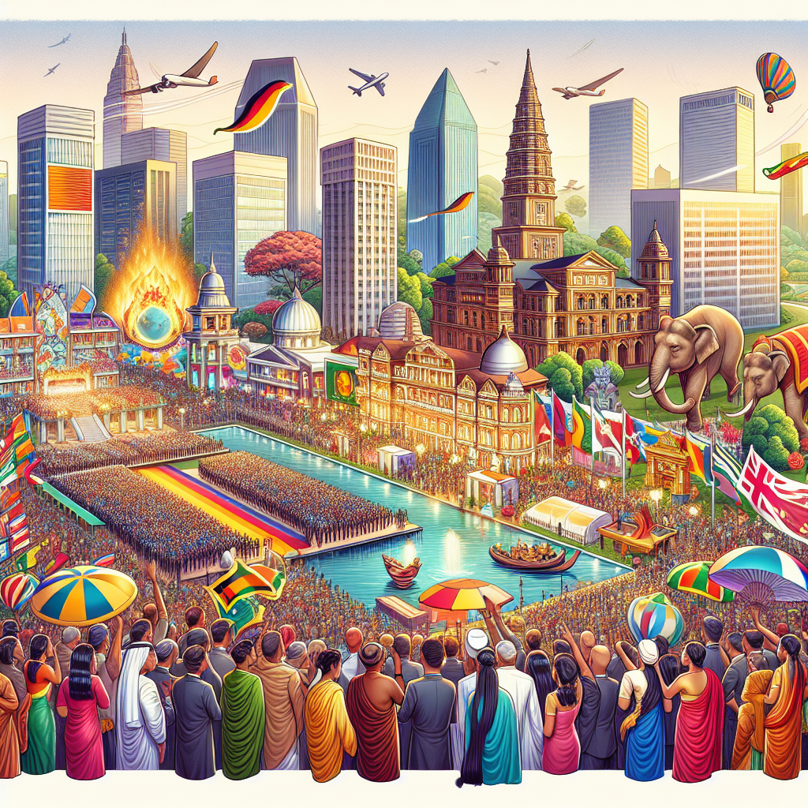

*City of Dreams Sri Lanka will come to the opening ceremony*

எண்|**தமிழ்**|ISO|*English*
---|---|---|---
1|**City**|City|*City*
2|**of**|of|*Compare*
3|**Dreams**|Dreams|*Trucks*
4|**Sri**|Sri|*Sri Lanka*
5|**Lanka**|Lanka|*Sri Lanka*
6|**ஆரம்ப**|ĀRaMPa|*Initial*
7|**விழாவுக்கு**|ViḺāVuKKu|*For the ceremony*
8|**ஷாருக்கான்**|ShāRuKKāṈ|*Shah Rukh Khan*
9|**வருவாரா**|VaRuVāRā?|*Will come*

---

## தெற்காசியாவின் முதலாவது ஒருங்கிணைந்த உல்லாச விடுதியான City of Dreams Sri Lankaவின் வரலாற்றுச் சிறப்புமிக்க ஆரம்ப விழா நிகழ்விற்கு முன்னதாக, பொலிவூட் கிங் கான் என்று அழைக்கப்படும் சூப்பர் ஸ்டார் ஷாருக்கான் கலந்துகொள்வது கொண்டாட்டங்களின் முக்கிய அம்சமாக திட்டமிடப்பட்டிருந்தது

TeṞKāCiYāViṈ MuTaLāVaTu ORuṄKiṆaiNTa ULLāCa ViṬuTiYāṈa City of Dreams Sri LankaViṈ VaRaLāṞṞuC CiṞaPPuMiKKa ĀRaMPa ViḺā NiKaḺViṞKu MuṈṈaTāKa PoLiVūṬ KiṄ KāṈ EṈṞu AḺaiKKaPPaṬuM CūPPaR SṬāR ShāRuKKāṈ KaLaNTuKoḶVaTu KoṆṬāṬṬaṄKaḶiṈ MuKKiYa AMCaMāKa TiṬṬaMiṬaPPaṬṬiRuNTaTu

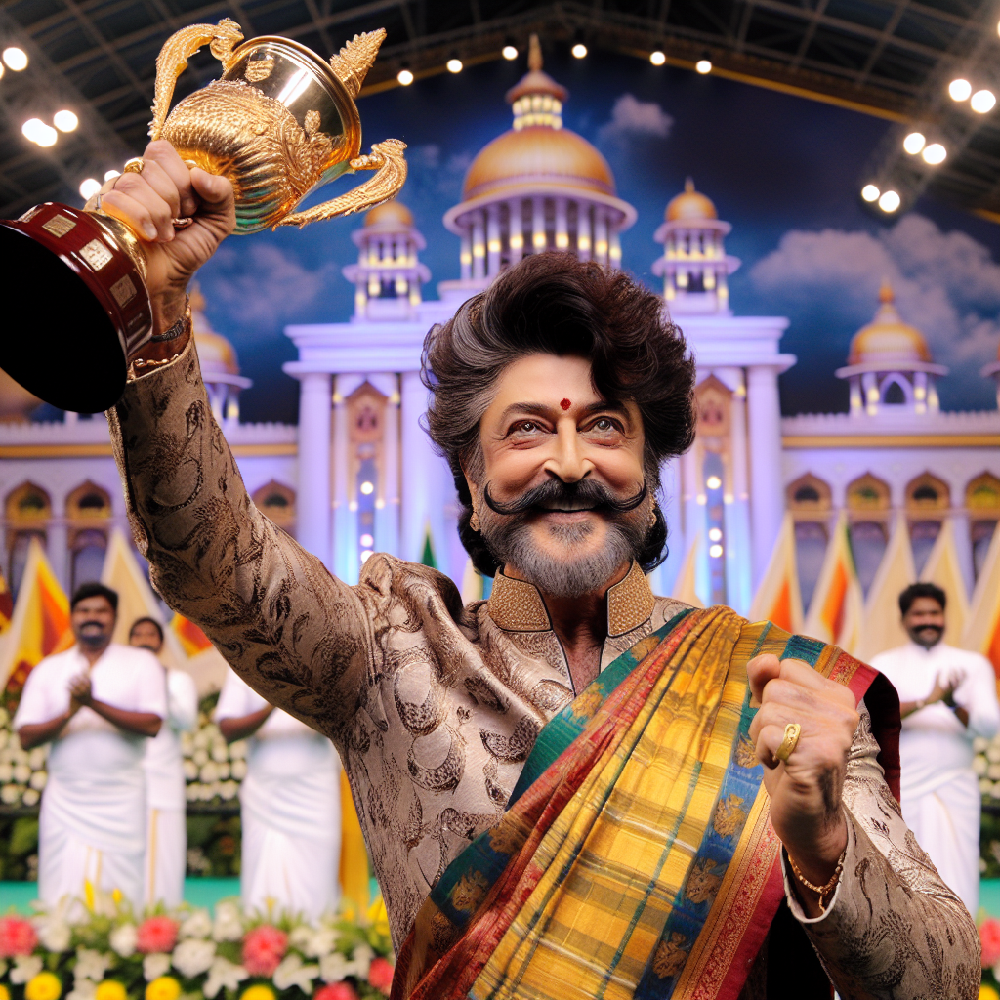

*Superstar Shah Rukh Khan, the so -called Bollywood King Khan, was a key feature of the celebration of South Asia's first integrated tournament, City of Dreams Sri Lanka's historic event.*

எண்|**தமிழ்**|ISO|*English*
---|---|---|---
1|**தெற்காசியாவின்**|TeṞKāCiYāViṈ|*South Asia*
2|**முதலாவது**|MuTaLāVaTu|*First*
3|**ஒருங்கிணைந்த**|ORuṄKiṆaiNTa|*Integrated*
4|**உல்லாச**|ULLāCa|*Excuse*
5|**விடுதியான**|ViṬuTiYāṈa|*Hotel*
6|**City**|City|*City*
7|**of**|of|*Compare*
8|**Dreams**|Dreams|*Trucks*
9|**Sri**|Sri|*Sri Lanka*
10|**Lankaவின்**|LankaViṈ|*LANKA Win*
11|**வரலாற்றுச்**|VaRaLāṞṞuC|*Historical*
12|**சிறப்புமிக்க**|CiṞaPPuMiKKa|*Excellent*
13|**ஆரம்ப**|ĀRaMPa|*Initial*
14|**விழா**|ViḺā|*Ceremony*
15|**நிகழ்விற்கு**|NiKaḺViṞKu|*For the event*
16|**முன்னதாக**|MuṈṈaTāKa,|*An end*
17|**பொலிவூட்**|PoLiVūṬ|*Bollywood*
18|**கிங்**|KiṄ|*King*
19|**கான்**|KāṈ|*Con*
20|**என்று**|EṈṞu|*That*
21|**அழைக்கப்படும்**|AḺaiKKaPPaṬuM|*So -called*
22|**சூப்பர்**|CūPPaR|*Super*
23|**ஸ்டார்**|SṬāR|*Star*
24|**ஷாருக்கான்**|ShāRuKKāṈ|*Shah Rukh Khan*
25|**கலந்துகொள்வது**|KaLaNTuKoḶVaTu|*Attending*
26|**கொண்டாட்டங்களின்**|KoṆṬāṬṬaṄKaḶiṈ|*Celebrations*
27|**முக்கிய**|MuKKiYa|*Prime*
28|**அம்சமாக**|AMCaMāKa|*Aspect*
29|**திட்டமிடப்பட்டிருந்தது**|TiṬṬaMiṬaPPaṬṬiRuNTaTu|*Was planned*
##  துரதிஷ்டவசமாக, அவரது கட்டுப்பாட்டிற்கு அப்பாற்பட்ட எதிர்பாராத தனிப்பட்ட காரணங்களால், ஷாருக்கான் இந்த நிகழ்வில் கலந்துகொள்ள முடியாத நிலை ஏற்பட்டுள்ளது

TuRaTiShṬaVaCaMāKa AVaRaTu KaṬṬuPPāṬṬiṞKu APPāṞPaṬṬa ETiRPāRāTa TaṈiPPaṬṬa KāRaṆaṄKaḶāL ShāRuKKāṈ INTa NiKaḺViL KaLaNTuKoḶḶa MuṬiYāTa NiLai ĒṞPaṬṬuḶḶaTu

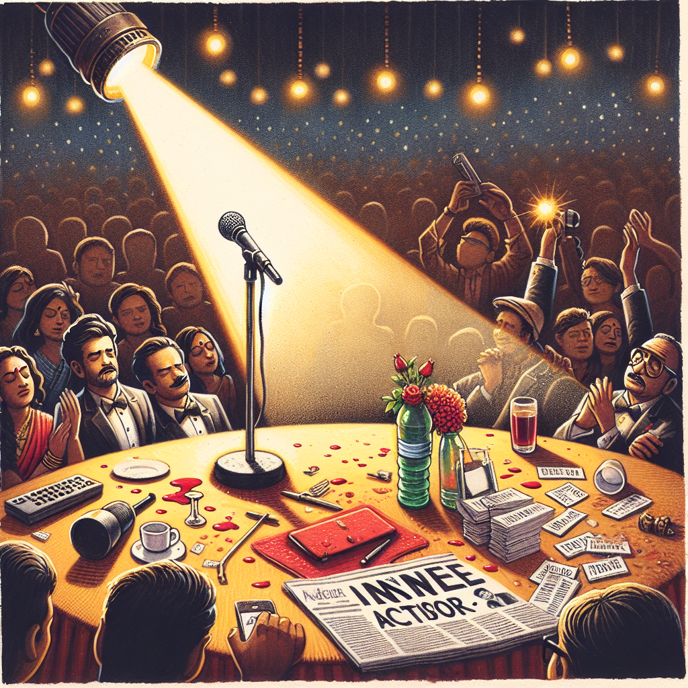

*Unfortunately, Shah Rukh Khan was unable to attend the event due to unexpected personal reasons beyond his control.*

எண்|**தமிழ்**|ISO|*English*
---|---|---|---
1|**துரதிஷ்டவசமாக**|TuRaTiShṬaVaCaMāKa,|*Unfortunately*
2|**அவரது**|AVaRaTu|*His*
3|**கட்டுப்பாட்டிற்கு**|KaṬṬuPPāṬṬiṞKu|*For control*
4|**அப்பாற்பட்ட**|APPāṞPaṬṬa|*Inferior*
5|**எதிர்பாராத**|ETiRPāRāTa|*Unexpected*
6|**தனிப்பட்ட**|TaṈiPPaṬṬa|*Personal*
7|**காரணங்களால்**|KāRaṆaṄKaḶāL,|*By the reason*
8|**ஷாருக்கான்**|ShāRuKKāṈ|*Shah Rukh Khan*
9|**இந்த**|INTa|*These*
10|**நிகழ்வில்**|NiKaḺViL|*At the event*
11|**கலந்துகொள்ள**|KaLaNTuKoḶḶa|*To attend*
12|**முடியாத**|MuṬiYāTa|*Impossible*
13|**நிலை**|NiLai|*Position*
14|**ஏற்பட்டுள்ளது**|ĒṞPaṬṬuḶḶaTu|*Have occurred*

---

## இதுதொடர்பில் City of Dreams Sri Lanka-வின் பேச்சாளர் ஒருவர் கருத்து தெரிவிக்கையில்,

ITuToṬaRPiL City of Dreams Sri Lanka-ViṈ PēCCāḶaR ORuVaR KaRuTTu TeRiViKKaiYiL

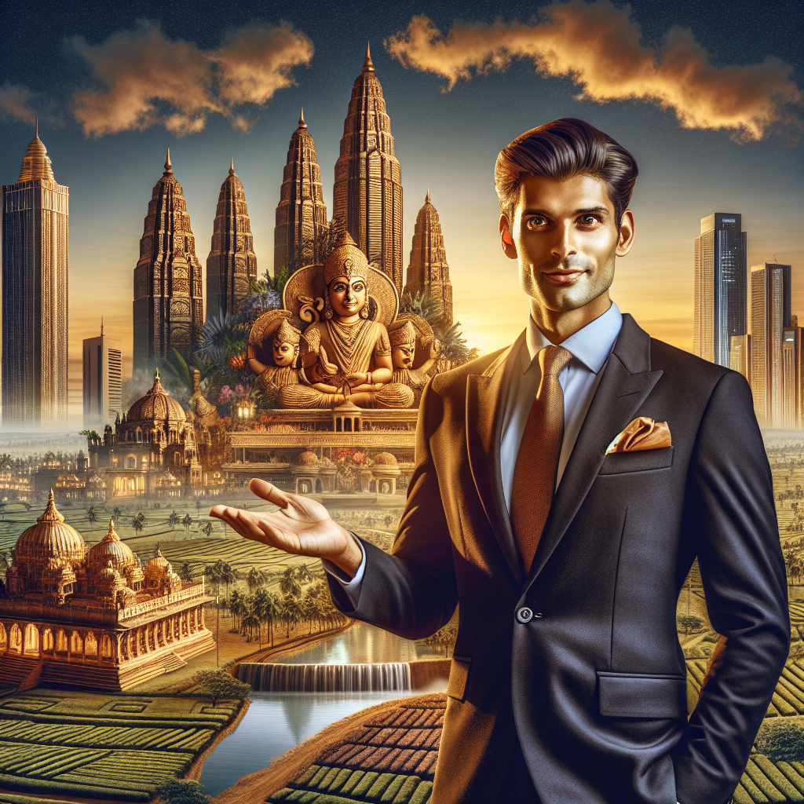

*A spokesman for City of Dreams Sri Lanka*

எண்|**தமிழ்**|ISO|*English*
---|---|---|---
1|**இதுதொடர்பில்**|ITuToṬaRPiL|*In this regard*
2|**City**|City|*City*
3|**of**|of|*Compare*
4|**Dreams**|Dreams|*Trucks*
5|**Sri**|Sri|*Sri Lanka*
6|**Lanka-வின்**|Lanka-ViṈ|*Lanka-vin*
7|**பேச்சாளர்**|PēCCāḶaR|*Speaker*
8|**ஒருவர்**|ORuVaR|*One*
9|**கருத்து**|KaRuTTu|*Expression*
10|**தெரிவிக்கையில்**|TeRiViKKaiYiL,|*As stated*

---

## “கானை வரவேற்பதற்காக நீங்கள் பலர் ஆவலுடன் காத்திருந்தீர்கள் என்பதை நாங்கள் புரிந்துகொள்கிறோம், உங்கள் எதிர்பார்ப்புக்கள் ஏமாற்றமடைந்ததை எங்களாலும் நன்கு உணர முடிகிறது

KāṈai VaRaVēṞPaTaṞKāKa NīṄKaḶ PaLaR ĀVaLuṬaṈ KāTTiRuNTīRKaḶ EṈPaTai NāṄKaḶ PuRiNTuKoḶKiṞōM UṄKaḶ ETiRPāRPPuKKaḶ ĒMāṞṞaMaṬaiNTaTai EṄKaḶāLuM NaṈKu UṆaRa MuṬiKiṞaTu

*We understand that many of you are eagerly waiting for you to welcome Khan.*

எண்|**தமிழ்**|ISO|*English*
---|---|---|---
1|**கானை**|“KāṈai|*Tin*
2|**வரவேற்பதற்காக**|VaRaVēṞPaTaṞKāKa|*In order to welcome*
3|**நீங்கள்**|NīṄKaḶ|*You*
4|**பலர்**|PaLaR|*So many people*
5|**ஆவலுடன்**|ĀVaLuṬaṈ|*Eagerly*
6|**காத்திருந்தீர்கள்**|KāTTiRuNTīRKaḶ|*Wait for you*
7|**என்பதை**|EṈPaTai|*See*
8|**நாங்கள்**|NāṄKaḶ|*We*
9|**புரிந்துகொள்கிறோம்**|PuRiNTuKoḶKiṞōM,|*We understand*
10|**உங்கள்**|UṄKaḶ|*Your*
11|**எதிர்பார்ப்புக்கள்**|ETiRPāRPPuKKaḶ|*Expectations*
12|**ஏமாற்றமடைந்ததை**|ĒMāṞṞaMaṬaiNTaTai|*The disappointment*
13|**எங்களாலும்**|EṄKaḶāLuM|*By us*
14|**நன்கு**|NaṈKu|*Well*
15|**உணர**|UṆaRa|*To realize*
16|**முடிகிறது**|MuṬiKiṞaTu|*Ends*
##  அவரது ஆதரவுக்கும் நல்லெண்ணத்திற்கும் நாங்கள் தொடர்ந்து ஆழ்ந்த நன்றியுடன் இருக்கிறோம், மேலும் எதிர்காலத்தில் கானை City of Dreams Sri Lankaவுக்கு வரவேற்பதை ஆவலுடன் எதிர்பார்க்கிறோம்

AVaRaTu ĀTaRaVuKKuM NaLLeṆṆaTTiṞKuM NāṄKaḶ ToṬaRNTu ĀḺNTa NaṈṞiYuṬaṈ IRuKKiṞōM MēLuM ETiRKāLaTTiL KāṈai City of Dreams Sri LankaVuKKu VaRaVēṞPaTai ĀVaLuṬaṈ ETiRPāRKKiṞōM

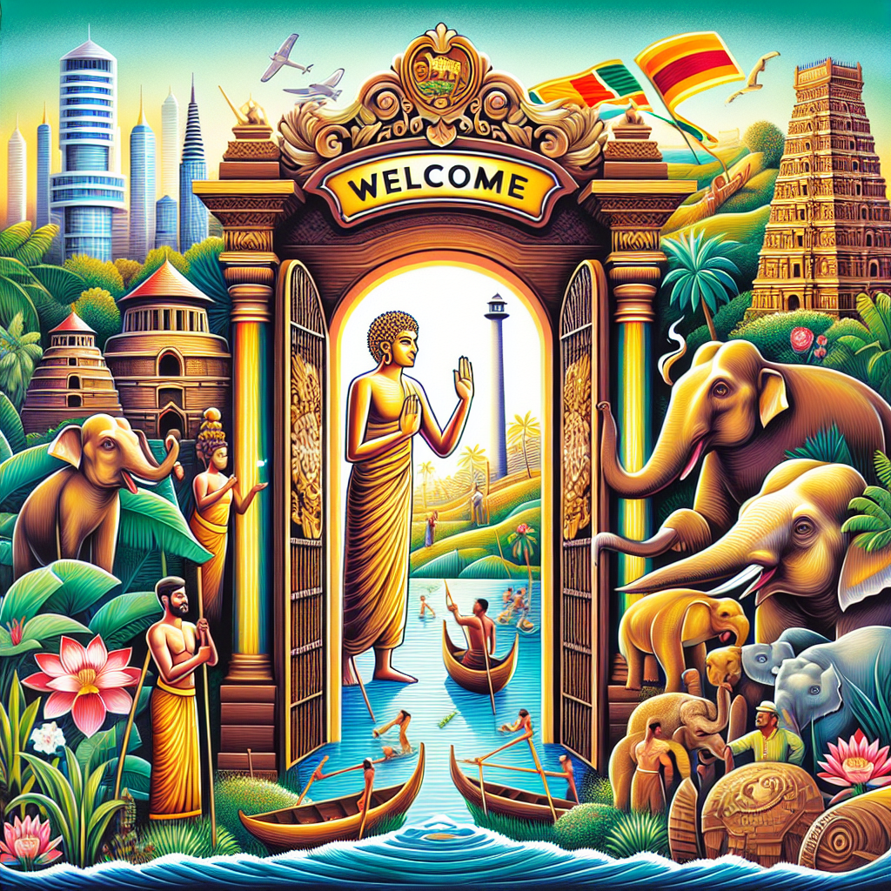

*We are constantly gratitude for his support and goodwill and we are eagerly expecting Khan to welcome Khan City of Dreams Sri Lanka*

எண்|**தமிழ்**|ISO|*English*
---|---|---|---
1|**அவரது**|AVaRaTu|*His*
2|**ஆதரவுக்கும்**|ĀTaRaVuKKuM|*Support*
3|**நல்லெண்ணத்திற்கும்**|NaLLeṆṆaTTiṞKuM|*For goodwill*
4|**நாங்கள்**|NāṄKaḶ|*We*
5|**தொடர்ந்து**|ToṬaRNTu|*Follow*
6|**ஆழ்ந்த**|ĀḺNTa|*Profound*
7|**நன்றியுடன்**|NaṈṞiYuṬaṈ|*Grateful*
8|**இருக்கிறோம்**|IRuKKiṞōM,|*Are*
9|**மேலும்**|MēLuM|*And*
10|**எதிர்காலத்தில்**|ETiRKāLaTTiL|*In the future*
11|**கானை**|KāṈai|*Tin*
12|**City**|City|*City*
13|**of**|of|*Compare*
14|**Dreams**|Dreams|*Trucks*
15|**Sri**|Sri|*Sri Lanka*
16|**Lankaவுக்கு**|LankaVuKKu|*LANKA*
17|**வரவேற்பதை**|VaRaVēṞPaTai|*Reception*
18|**ஆவலுடன்**|ĀVaLuṬaṈ|*Eagerly*
19|**எதிர்பார்க்கிறோம்**|ETiRPāRKKiṞōM|*We expect*

---

## ஷாருக்கான் வருகை ரத்தாகியிருந்தாலும், City of Dreams Sri Lanka வின் ஆரம்ப விழா ஒரு முக்கிய கொண்டாட்டமாக திட்டமிட்டவாறு விமர்சையாக நடைபெறும்

ShāRuKKāṈ VaRuKai RaTTāKiYiRuNTāLuM City of Dreams Sri Lanka ViṈ ĀRaMPa ViḺā ORu MuKKiYa KoṆṬāṬṬaMāKa TiṬṬaMiṬṬaVāṞu ViMaRCaiYāKa NaṬaiPeṞuM

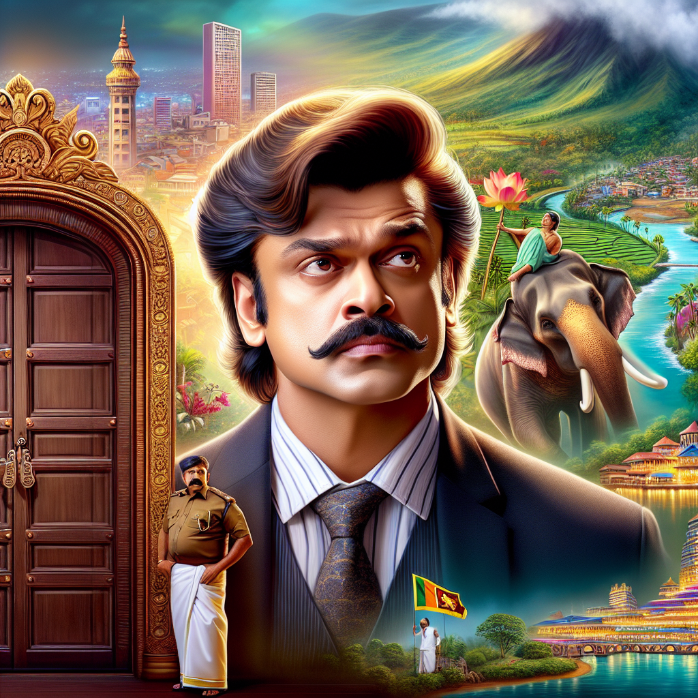

*Although Shah Rukh Khan's visit is canceled, the City of Dreams Sri Lanka*

எண்|**தமிழ்**|ISO|*English*
---|---|---|---
1|**ஷாருக்கான்**|ShāRuKKāṈ|*Shah Rukh Khan*
2|**வருகை**|VaRuKai|*Attendance*
3|**ரத்தாகியிருந்தாலும்**|RaTTāKiYiRuNTāLuM,|*Although canceled*
4|**City**|City|*City*
5|**of**|of|*Compare*
6|**Dreams**|Dreams|*Trucks*
7|**Sri**|Sri|*Sri Lanka*
8|**Lanka**|Lanka|*Sri Lanka*
9|**வின்**|ViṈ|*Vin*
10|**ஆரம்ப**|ĀRaMPa|*Initial*
11|**விழா**|ViḺā|*Ceremony*
12|**ஒரு**|ORu|*A*
13|**முக்கிய**|MuKKiYa|*Prime*
14|**கொண்டாட்டமாக**|KoṆṬāṬṬaMāKa|*Celebration*
15|**திட்டமிட்டவாறு**|TiṬṬaMiṬṬaVāṞu|*As planned*
16|**விமர்சையாக**|ViMaRCaiYāKa|*Critical*
17|**நடைபெறும்**|NaṬaiPeṞuM|*Will take place*
##  உள்ளூர் மற்றும் சர்வதேச அளவிலிருந்தும் தேர்ந்தெடுக்கப்பட்ட திறமையான கலைஞர்கள் இதில் பங்கேற்கவுள்ளனர்

UḶḶūR MaṞṞuM CaRVaTēCa AḶaViLiRuNTuM TēRNTeṬuKKaPPaṬṬa TiṞaMaiYāṈa KaLaiÑaRKaḶ ITiL PaṄKēṞKaVuḶḶaṈaR

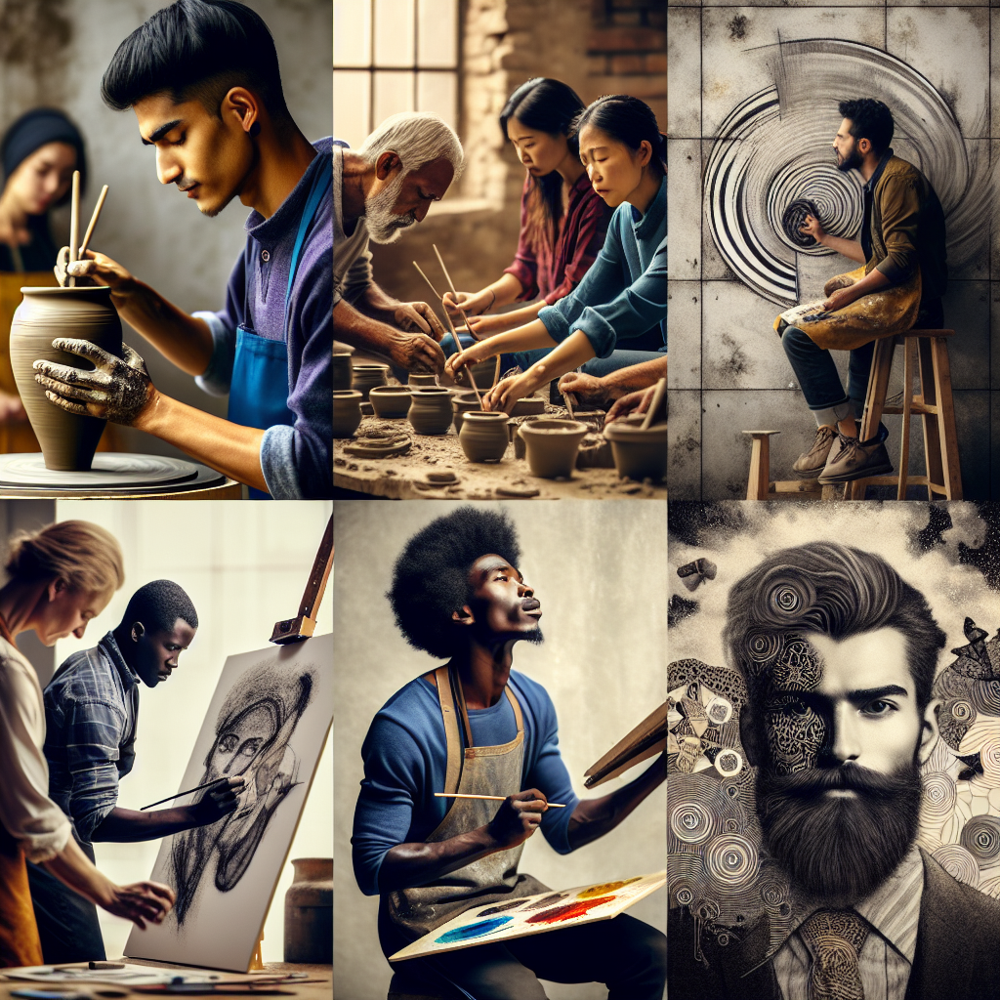

*Selected talented artists from local and international levels will participate*

எண்|**தமிழ்**|ISO|*English*
---|---|---|---
1|**உள்ளூர்**|UḶḶūR|*Local*
2|**மற்றும்**|MaṞṞuM|*And*
3|**சர்வதேச**|CaRVaTēCa|*International*
4|**அளவிலிருந்தும்**|AḶaViLiRuNTuM|*Quantity*
5|**தேர்ந்தெடுக்கப்பட்ட**|TēRNTeṬuKKaPPaṬṬa|*Chosen*
6|**திறமையான**|TiṞaMaiYāṈa|*Efficient*
7|**கலைஞர்கள்**|KaLaiÑaRKaḶ|*Artists*
8|**இதில்**|ITiL|*In which*
9|**பங்கேற்கவுள்ளனர்**|PaṄKēṞKaVuḶḶaṈaR|*They will participate*
##  அவர்களது விபரங்கள் அடுத்த சில நாட்களில் வெளியிடப்படும்

AVaRKaḶaTu ViPaRaṄKaḶ AṬuTTa CiLa NāṬKaḶiL VeḶiYiṬaPPaṬuM

*Their details will be released in the next few days*

எண்|**தமிழ்**|ISO|*English*
---|---|---|---
1|**அவர்களது**|AVaRKaḶaTu|*Their*
2|**விபரங்கள்**|ViPaRaṄKaḶ|*Details*
3|**அடுத்த**|AṬuTTa|*Next*
4|**சில**|CiLa|*Some*
5|**நாட்களில்**|NāṬKaḶiL|*Days*
6|**வெளியிடப்படும்**|VeḶiYiṬaPPaṬuM|*Will be released*
##  எனவே, உலகத்தரம் வாய்ந்த பொழுதுபோக்கு இடமாக இலங்கையை உலகளவில் அங்கீகரிக்கச் செய்வதற்கான முக்கிய மைல்கல்லாக இந்த நிகழ்வை மாற்ற நாங்கள் உறுதிபூண்டுள்ளோம்

EṈaVē ULaKaTTaRaM VāYNTa PoḺuTuPōKKu IṬaMāKa ILaṄKaiYai ULaKaḶaViL AṄKīKaRiKKaC CeYVaTaṞKāṈa MuKKiYa MaiLKaLLāKa INTa NiKaḺVai MāṞṞa NāṄKaḶ UṞuTiPūṆṬuḶḶōM

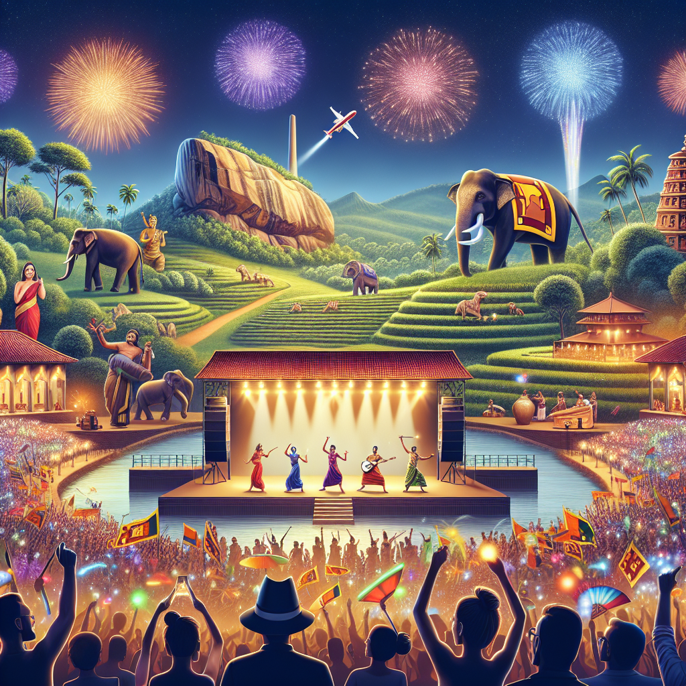

*Therefore, we are committed to transforming this event into a major milestone for recognizing Sri Lanka as a world -class entertainment place*

எண்|**தமிழ்**|ISO|*English*
---|---|---|---
1|**எனவே**|EṈaVē,|*Therefore*
2|**உலகத்தரம்**|ULaKaTTaRaM|*World standard*
3|**வாய்ந்த**|VāYNTa|*Right*
4|**பொழுதுபோக்கு**|PoḺuTuPōKKu|*Entertainment*
5|**இடமாக**|IṬaMāKa|*Place*
6|**இலங்கையை**|ILaṄKaiYai|*Sri Lanka*
7|**உலகளவில்**|ULaKaḶaViL|*Worldwide*
8|**அங்கீகரிக்கச்**|AṄKīKaRiKKaC|*Recognize*
9|**செய்வதற்கான**|CeYVaTaṞKāṈa|*Acting*
10|**முக்கிய**|MuKKiYa|*Prime*
11|**மைல்கல்லாக**|MaiLKaLLāKa|*Milestone*
12|**இந்த**|INTa|*These*
13|**நிகழ்வை**|NiKaḺVai|*Exemption*
14|**மாற்ற**|MāṞṞa|*Convert*
15|**நாங்கள்**|NāṄKaḶ|*We*
16|**உறுதிபூண்டுள்ளோம்**|UṞuTiPūṆṬuḶḶōM|*We are confirmed*
## " என கூறினார்

EṈa KūṞiṈāR

*Said*

எண்|**தமிழ்**|ISO|*English*
---|---|---|---
1|**என**|EṈa|*As*
2|**கூறினார்**|KūṞiṈāR|*Said*

---

## "ஷாருக்கான், அவரது கட்டுப்பாட்டிற்கு அப்பாற்பட்ட, எதிர்பாராத மற்றும் தவிர்க்க முடியாத தனிப்பட்ட காரணங்களால், City of Dreams Sri Lankaவின் ஆரம்ப நிகழ்வில் திட்டமிட்டபடி கலந்துகொள்ள இயலாது என்பதை வருத்தத்துடன் தெரிவித்துக்கொள்கிறோம்

ShāRuKKāṈ AVaRaTu KaṬṬuPPāṬṬiṞKu APPāṞPaṬṬa ETiRPāRāTa MaṞṞuM TaViRKKa MuṬiYāTa TaṈiPPaṬṬa KāRaṆaṄKaḶāL City of Dreams Sri LankaViṈ ĀRaMPa NiKaḺViL TiṬṬaMiṬṬaPaṬi KaLaNTuKoḶḶa IYaLāTu EṈPaTai VaRuTTaTTuṬaṈ TeRiViTTuKKoḶKiṞōM

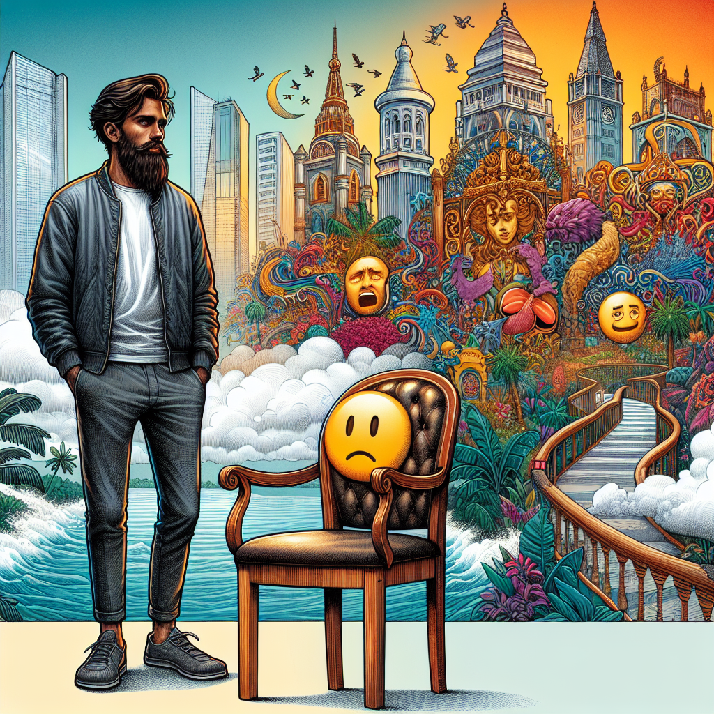

*We regret that the City of Dreams Sri Lanka is unable to attend the initial event due to unexpected and inevitable personal reasons beyond Shah Rukh Khan.*

எண்|**தமிழ்**|ISO|*English*
---|---|---|---
1|**ஷாருக்கான்**|"ShāRuKKāṈ,|*Shah Rukh Khan*
2|**அவரது**|AVaRaTu|*His*
3|**கட்டுப்பாட்டிற்கு**|KaṬṬuPPāṬṬiṞKu|*For control*
4|**அப்பாற்பட்ட**|APPāṞPaṬṬa,|*Inferior*
5|**எதிர்பாராத**|ETiRPāRāTa|*Unexpected*
6|**மற்றும்**|MaṞṞuM|*And*
7|**தவிர்க்க**|TaViRKKa|*Avoid*
8|**முடியாத**|MuṬiYāTa|*Impossible*
9|**தனிப்பட்ட**|TaṈiPPaṬṬa|*Personal*
10|**காரணங்களால்**|KāRaṆaṄKaḶāL,|*By the reason*
11|**City**|City|*City*
12|**of**|of|*Compare*
13|**Dreams**|Dreams|*Trucks*
14|**Sri**|Sri|*Sri Lanka*
15|**Lankaவின்**|LankaViṈ|*LANKA Win*
16|**ஆரம்ப**|ĀRaMPa|*Initial*
17|**நிகழ்வில்**|NiKaḺViL|*At the event*
18|**திட்டமிட்டபடி**|TiṬṬaMiṬṬaPaṬi|*As planned*
19|**கலந்துகொள்ள**|KaLaNTuKoḶḶa|*To attend*
20|**இயலாது**|IYaLāTu|*Impossible*
21|**என்பதை**|EṈPaTai|*See*
22|**வருத்தத்துடன்**|VaRuTTaTTuṬaṈ|*Grief*
23|**தெரிவித்துக்கொள்கிறோம்**|TeRiViTTuKKoḶKiṞōM|*We report*

---

## இலங்கையும் அதன் அற்புதமான மக்களும் திரு

ILaṄKaiYuM ATaṈ AṞPuTaMāṈa MaKKaḶuM TiRu

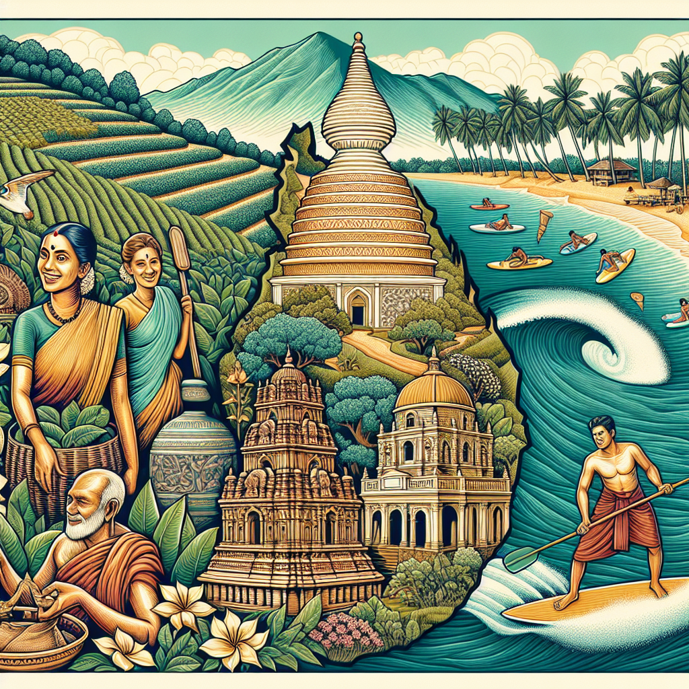

*Sri Lanka and its wonderful people*

எண்|**தமிழ்**|ISO|*English*
---|---|---|---
1|**இலங்கையும்**|ILaṄKaiYuM|*Sri Lanka and*
2|**அதன்**|ATaṈ|*The same*
3|**அற்புதமான**|AṞPuTaMāṈa|*Amazing*
4|**மக்களும்**|MaKKaḶuM|*People*
5|**திரு**|TiRu|*Mr.*
##  ஷாருக்கான் மனதில் ஒரு சிறப்பான இடத்தைப் பிடித்துள்ளனர், மேலும் இந்த ஆரம்ப நிகழ்வின் ஒரு பகுதியாக இருப்பதில் அவர் உண்மையாகவே உற்சாகமாக இருந்தார்

ShāRuKKāṈ MaṈaTiL ORu CiṞaPPāṈa IṬaTTaiP PiṬiTTuḶḶaṈaR MēLuM INTa ĀRaMPa NiKaḺViṈ ORu PaKuTiYāKa IRuPPaTiL AVaR UṆMaiYāKaVē UṞCāKaMāKa IRuNTāR

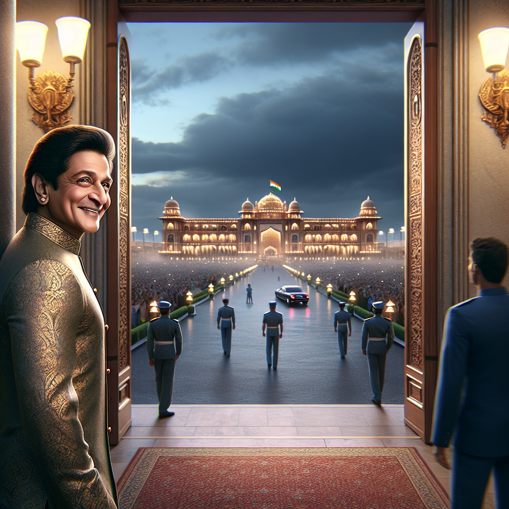

*Shah Rukh Khan has a good place in the mind and he was really excited about being part of this early event*

எண்|**தமிழ்**|ISO|*English*
---|---|---|---
1|**ஷாருக்கான்**|ShāRuKKāṈ|*Shah Rukh Khan*
2|**மனதில்**|MaṈaTiL|*In mind*
3|**ஒரு**|ORu|*A*
4|**சிறப்பான**|CiṞaPPāṈa|*Excellent*
5|**இடத்தைப்**|IṬaTTaiP|*Loan*
6|**பிடித்துள்ளனர்**|PiṬiTTuḶḶaṈaR,|*Are holding up*
7|**மேலும்**|MēLuM|*And*
8|**இந்த**|INTa|*These*
9|**ஆரம்ப**|ĀRaMPa|*Initial*
10|**நிகழ்வின்**|NiKaḺViṈ|*Casual*
11|**பகுதியாக**|PaKuTiYāKa|*Part*
12|**இருப்பதில்**|IRuPPaTiL|*In existence*
13|**அவர்**|AVaR|*He*
14|**உண்மையாகவே**|UṆMaiYāKaVē|*Truly*
15|**உற்சாகமாக**|UṞCāKaMāKa|*Excitedly*
16|**இருந்தார்**|IRuNTāR|*Was*
##  City of Dreams Sri Lanka நிர்வாகத்திற்கும், அவர்களின் அளவற்ற உற்சாகத்திற்கும் ஆதரவிற்கும் நல்வாழ்த்துக்கள் தெரிவித்தவர்களுக்கும் அவர் மனமார்ந்த நன்றியைத் தெரிவித்துக் கொள்கிறார்

City of Dreams Sri Lanka NiRVāKaTTiṞKuM AVaRKaḶiṈ AḶaVaṞṞa UṞCāKaTTiṞKuM ĀTaRaViṞKuM NaLVāḺTTuKKaḶ TeRiViTTaVaRKaḶuKKuM AVaR MaṈaMāRNTa NaṈṞiYaiT TeRiViTTuK KoḶKiṞāR

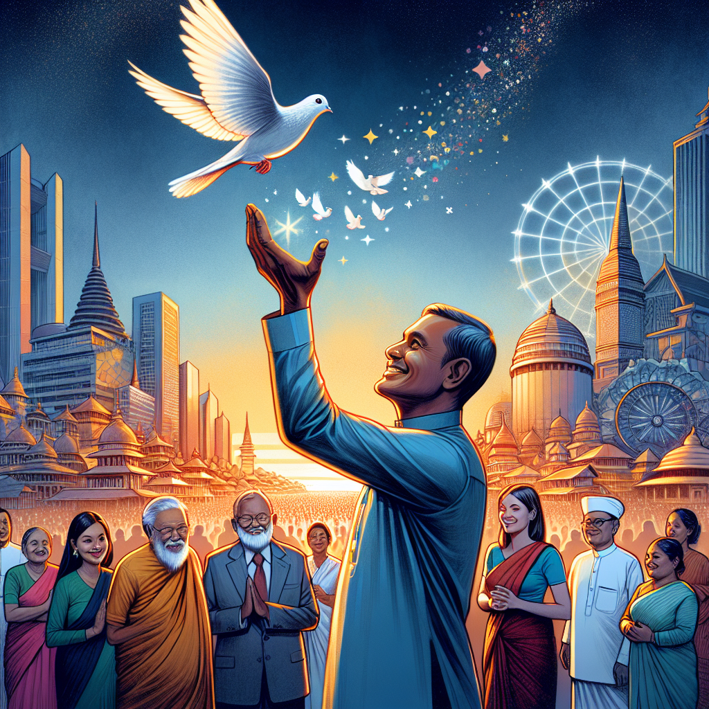

*He expresses his heartfelt gratitude to the management of the City of Dreams Sri Lanka and their infinite enthusiasm*

எண்|**தமிழ்**|ISO|*English*
---|---|---|---
1|**City**|City|*City*
2|**of**|of|*Compare*
3|**Dreams**|Dreams|*Trucks*
4|**Sri**|Sri|*Sri Lanka*
5|**Lanka**|Lanka|*Sri Lanka*
6|**நிர்வாகத்திற்கும்**|NiRVāKaTTiṞKuM,|*Administrative*
7|**அவர்களின்**|AVaRKaḶiṈ|*Their*
8|**அளவற்ற**|AḶaVaṞṞa|*Conities*
9|**உற்சாகத்திற்கும்**|UṞCāKaTTiṞKuM|*For enthusiasm*
10|**ஆதரவிற்கும்**|ĀTaRaViṞKuM|*Support*
11|**நல்வாழ்த்துக்கள்**|NaLVāḺTTuKKaḶ|*Welfare*
12|**தெரிவித்தவர்களுக்கும்**|TeRiViTTaVaRKaḶuKKuM|*And those who have expressed*
13|**அவர்**|AVaR|*He*
14|**மனமார்ந்த**|MaṈaMāRNTa|*Sincere*
15|**நன்றியைத்**|NaṈṞiYaiT|*Gratitude*
16|**தெரிவித்துக்**|TeRiViTTuK|*Report*
17|**கொள்கிறார்**|KoḶKiṞāR|*Coheses*
##  எதிர்காலத்தில் திரு

ETiRKāLaTTiL TiRu

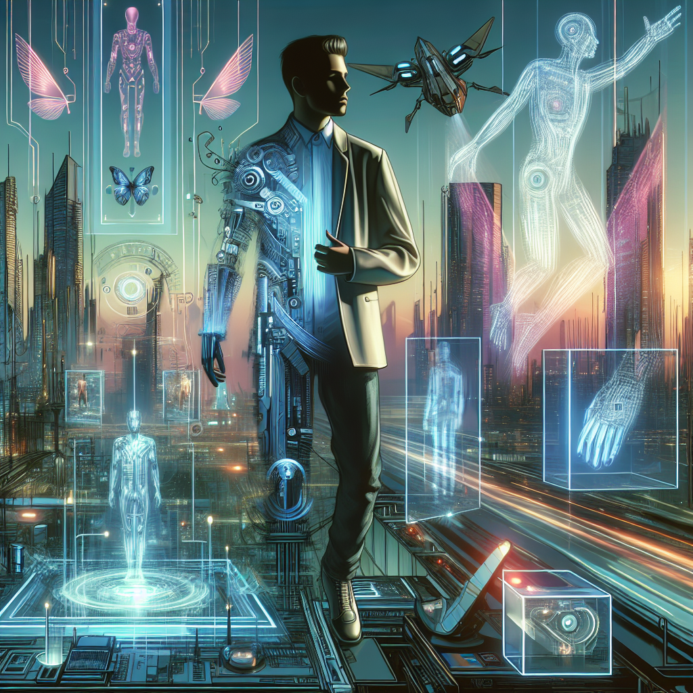

*Mr. in the future*

எண்|**தமிழ்**|ISO|*English*
---|---|---|---
1|**எதிர்காலத்தில்**|ETiRKāLaTTiL|*In the future*
2|**திரு**|TiRu|*Mr.*
##  ஷாருக்கான் இலங்கைக்கு விஜயம் செய்யும் வாய்ப்புகளை நாங்கள் ஆவலுடன் எதிர்பார்க்கிறோம்

ShāRuKKāṈ ILaṄKaiKKu ViJaYaM CeYYuM VāYPPuKaḶai NāṄKaḶ ĀVaLuṬaṈ ETiRPāRKKiṞōM

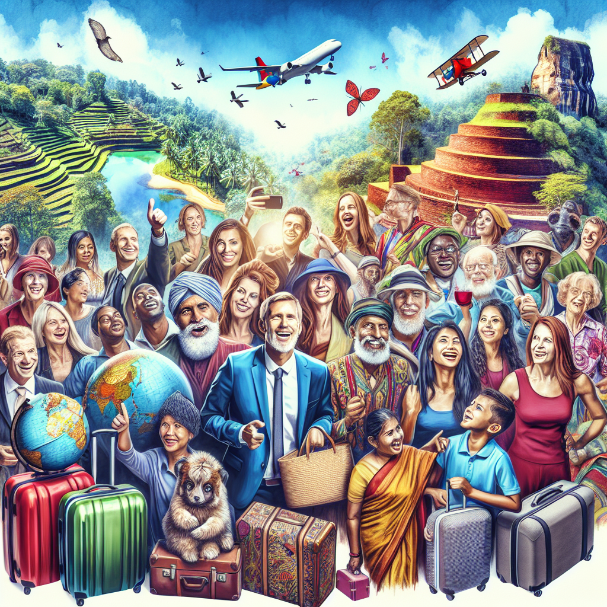

*We are eagerly expecting the chances of visiting Shah Rukh Khan Sri Lanka*

எண்|**தமிழ்**|ISO|*English*
---|---|---|---
1|**ஷாருக்கான்**|ShāRuKKāṈ|*Shah Rukh Khan*
2|**இலங்கைக்கு**|ILaṄKaiKKu|*To Sri Lanka*
3|**விஜயம்**|ViJaYaM|*Visit*
4|**செய்யும்**|CeYYuM|*Will*
5|**வாய்ப்புகளை**|VāYPPuKaḶai|*Opportunities*
6|**நாங்கள்**|NāṄKaḶ|*We*
7|**ஆவலுடன்**|ĀVaLuṬaṈ|*Eagerly*
8|**எதிர்பார்க்கிறோம்**|ETiRPāRKKiṞōM|*We expect*

---
